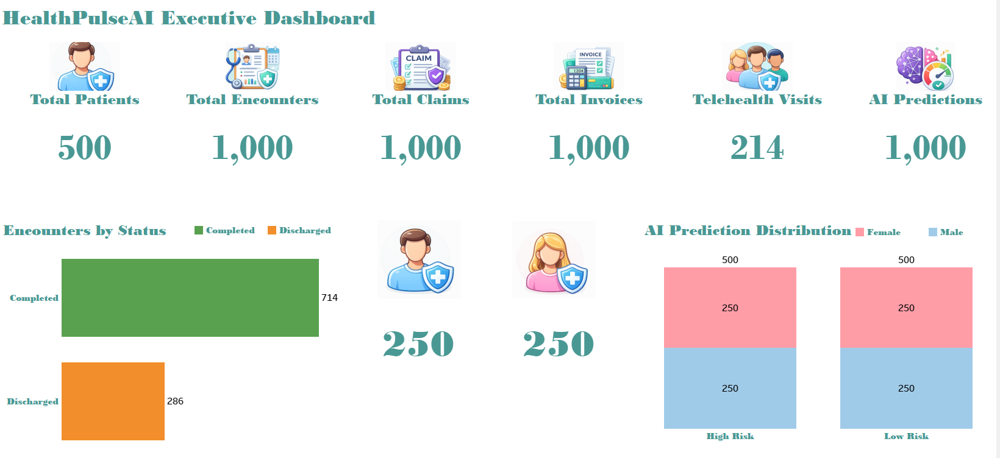

# HealthPulseAI

## Enterprise Healthcare Analytics and AI Platform

HealthPulseAI is an end-to-end healthcare analytics portfolio project built using SQL Server, Python, machine learning, and Tableau.

The project integrates clinical, hospital, telehealth, insurance, billing, marketing, and AI prediction data into one analytics platform. It demonstrates database design, ETL development, data validation, exploratory analysis, predictive modeling, and executive dashboard development.

---

## Dashboard Preview



> Update the image filename above if your screenshot has a different name.

---

## Project Objectives

- Build a production-style healthcare database in SQL Server
- Organize data across multiple business schemas
- Create reusable analytics views and stored procedures
- Extract SQL Server data using Python
- Validate data quality and analyze missing values
- Perform exploratory data analysis
- Demonstrate patient-risk classification using machine learning
- Build an executive Tableau dashboard

---

## Technology Stack

| Area | Technologies |
|---|---|
| Database | SQL Server, SSMS, T-SQL |
| Data Engineering | Python, Pandas, SQLAlchemy, PyODBC |
| Machine Learning | Scikit-learn, Random Forest |
| Visualization | Tableau, Matplotlib |
| Environment | Miniconda, VS Code |
| Version Control | Git, GitHub |

---

## Project Architecture

```text
SQL Server Database
        |
        v
Python Data Extraction
        |
        v
Data Validation and EDA
        |
        v
Machine Learning
        |
        v
Tableau Executive Dashboardcode README.md

SQL Server Architecture

The database is organized into multiple schemas:

Hospital
Clinical
Telehealth
Insurance
Billing
Marketing
AI
Analytics

The database includes production-style tables for:

Patients
Encounters
Diagnoses
Procedures
Medications
Telehealth visits
Insurance claims
Claim lines
Invoices
Payments
Marketing interactions
AI model predictions
Model monitoring

The Analytics schema contains reusable views and stored procedures for reporting and dashboard development.

Python Analytics Pipeline

The Python workflow includes five main stages:

SQL Server database connection
Data extraction
Data validation
Exploratory data analysis
Machine-learning classification

Main Python scripts:

04_Python/
├── 001_database_connection.py
├── 002_extract_data.py
├── 003_data_validation.py
├── 004_exploratory_analysis.py
└── 005_machine_learning.py
Data Extracted

The Python pipeline extracted the following datasets:

Dataset	Records
Patients	500
Encounters	1,000
Telehealth Visits	214
Claims	1,000
Invoices	1,000
AI Predictions	1,000
Data Validation

The validation process checks:

Row counts
Column counts
Duplicate records
Missing values
Empty columns
Dataset structure

The validation results are exported as reusable reports.

Exploratory Data Analysis

The exploratory analysis includes:

Dataset row-count comparisons
Missing-value analysis
Dataset summaries
Chart generation
Data-quality observations

Outputs are saved under the Python reports and charts folders.

Machine-Learning Demonstration

A Random Forest classifier was used to classify patients into:

High Risk
Low Risk

Model features included:

Predicted Value
Probability Score
Risk Score
Threshold Used

The model achieved 100% test accuracy.

This result should be interpreted as a pipeline demonstration because the target class in the synthetic dataset was derived from the same risk-related features used by the model. It does not represent real-world clinical model performance.

Tableau Executive Dashboard

The Tableau dashboard presents executive-level healthcare metrics, including:

Total Patients
Total Encounters
Total Claims
Total Invoices
Telehealth Visits
AI Predictions
Encounter Status
AI Prediction Distribution
Patient Gender Distribution

The dashboard was designed to provide a concise overview of operational, financial, telehealth, and AI performance.

Repository Structure
HealthPulse-AI/
├── 01_Project_Management/
├── 02_Documentation/
├── 03_SQL_Server/
├── 04_Python/
├── 06_Tableau/
├── environment.yml
├── requirements.txt
└── README.md
How to Run the Project
1. Create the Python environment
conda env create -f environment.yml
conda activate healthpulse
2. Configure the SQL Server connection

Create a local .env file and add your SQL Server connection values.

Example:

DB_SERVER=localhost
DB_DATABASE=HealthPulseAI
DB_DRIVER=ODBC Driver 18 for SQL Server
DB_TRUSTED_CONNECTION=yes
DB_TRUST_SERVER_CERTIFICATE=yes

Do not upload the .env file to GitHub.

3. Run the Python pipeline

From the project root:

python 04_Python/001_database_connection.py
python 04_Python/002_extract_data.py
python 04_Python/003_data_validation.py
python 04_Python/004_exploratory_analysis.py
python 04_Python/005_machine_learning.py
4. Open the Tableau dashboard

Open the Tableau workbook stored in:

06_Tableau/
Key Skills Demonstrated
Healthcare data modeling
Relational database design
Advanced SQL development
Stored procedure development
Analytics view creation
Python ETL development
Data-quality validation
Exploratory data analysis
Machine-learning implementation
Tableau dashboard design
Git and GitHub version control
Technical project documentation
Future Improvements

Possible future enhancements include:

Real-time dashboard refresh
Additional healthcare KPIs
Claim-denial prediction
Patient readmission prediction
Model explainability
Cloud deployment
Automated ETL scheduling
Tableau Server or Tableau Cloud integration
Author

Kanwal Naz

Data Scientist | Healthcare Analytics | SQL Server | Python | Machine Learning | Tableau